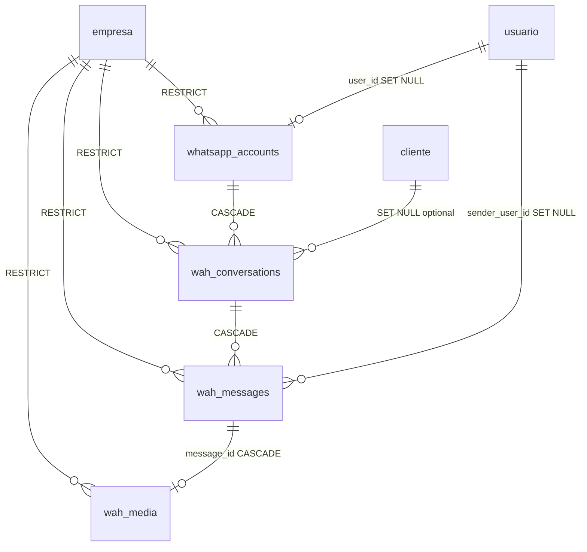

# ERD — Comunicaciones (WAH)

Fuente SQL: `005_comunicaciones_wah.sql`

## Entidades

## Tablas

| Tabla | PK | Tenancy | Notas |
|-------|-----|---------|-------|
| `whatsapp_accounts` | id | empresa_id RESTRICT | user_id? FK usuario; UNIQUE parcial `whatsapp_accounts_user_id_uidx` |
| `wah_conversations` | id | empresa_id RESTRICT | bot_paused, cliente_id? — **sin user_id** |
| `wah_messages` | id | empresa_id RESTRICT | wamid UNIQUE parcial; direction CHECK; sender_user_id? — **sin media_id** |
| `wah_media` | id | empresa_id RESTRICT | message_id NOT NULL → wah_messages CASCADE; meta_media_id? |

## Índices parciales UNIQUE

| Índice | Columna | Condición |
|--------|---------|-----------|
| `uq_wah_messages_wamid` | wamid | WHERE wamid IS NOT NULL |
| `whatsapp_accounts_user_id_uidx` | user_id | WHERE user_id IS NOT NULL |
| `uq_wah_media_meta_media_id` | meta_media_id | WHERE meta_media_id IS NOT NULL |

## CASCADE chain

`whatsapp_accounts` → `wah_conversations` → `wah_messages` → `wah_media` (via `message_id`)
